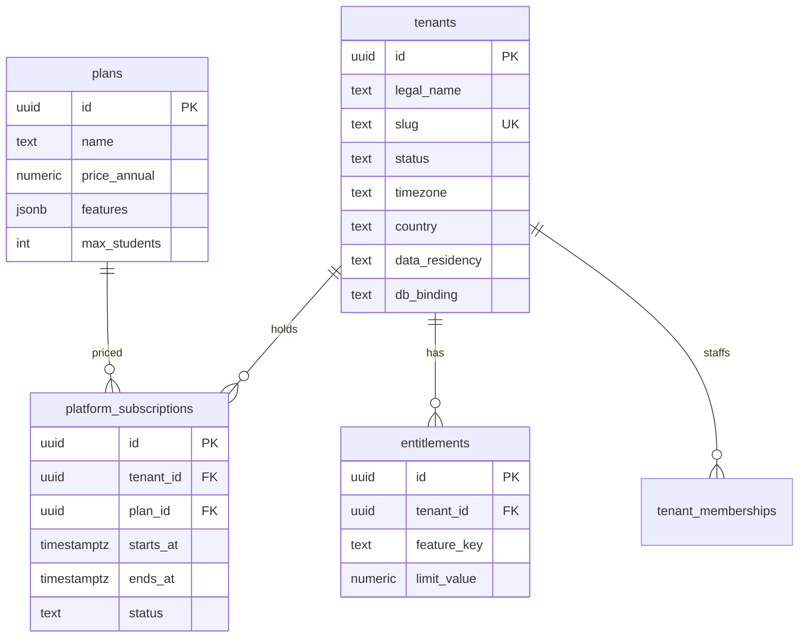
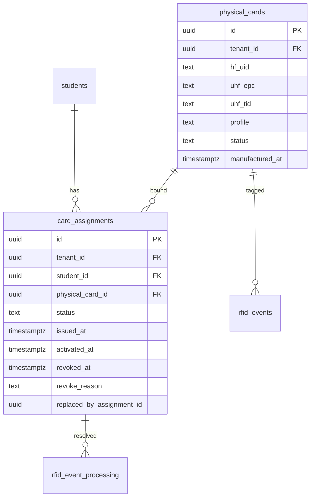
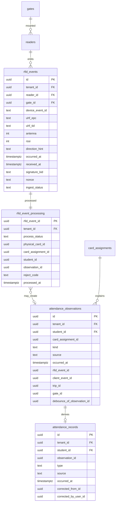
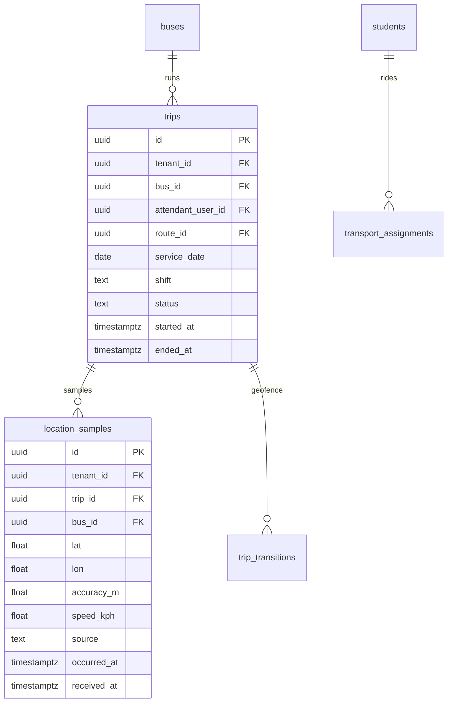
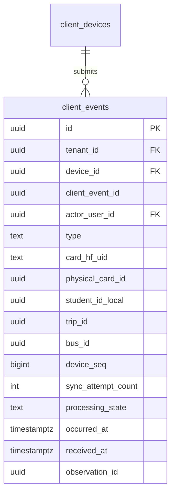

# Database architecture

**Status:** Architecture is authoritative. Phase 1 implemented identity, tenancy, RLS, audit, and outbox tables. Product-domain tables remain future work. See [phase-1.md](phase-1.md).

Shared PostgreSQL for all schools. **Every tenant-owned table has `tenant_id UUID NOT NULL`.** Row Level Security is **ENABLE + FORCE** on those tables. Application `WHERE tenant_id` is not the isolation control.

Related: [architecture.md](architecture.md) §5, [security.md](security.md).

---

## Decision: shared schema, not DB-per-school

| | |
| --- | --- |
| **Why needed** | One migration stream for 1–10 schools; isolation strong enough for children’s data. |
| **Alternatives** | DB-per-tenant; schema-per-tenant; Citus. |
| **Tradeoffs** | Noisy neighbor; mitigated with pooling, partitioning, later tenant-group sharding. Dedicated DB is a **routing** feature later. |
| **Scale** | Hundreds of schools on one Flexible Server if event tables are partitioned. |
| **Security** | FORCE RLS + transaction GUCs. Bypass role is break-glass only, not in app DSNs. |
| **Cost** | One server vs N servers. |

---

## Conventions

- PKs: UUID v7 for event-like tables; UUID v4 acceptable for slowly changing entities.
- Timestamps: `timestamptz`. **`occurred_at`** = business/device/reader time. **`received_at`** = server ingest time. Never overload one column.
- Soft-hide people: `deleted_at` / `pii_state`. **Events and card_assignments are not rewritten** to change history.
- Money: `NUMERIC(12,2)` + `currency CHAR(3)` (`INR`).
- Human identifiers (`admission_no`, bus registration) unique **per tenant**.
- `historical_subject_id` on `students`: opaque UUID for post-anonymization meaning.

---

## Tenant-owned vs platform tables

**Tenant-owned (FORCE RLS):** students, enrollments, guardians, physical_cards, card_assignments, gates, readers, rfid_events, rfid_event_processing, attendance_observations, attendance_records, buses, routes, stops, trips, transport_assignments, location_samples, academics, results, announcements, invoices, payments (school-fee), files, client_events, notifications, notification_deliveries, push_tokens, staff_profiles, tenant_memberships, etc.

**Phase 1 `client_devices` exception:** implemented as a user-scoped platform table (no `tenant_id`) because devices belong to global `users` before school session binding. NFC `client_events` remain tenant-owned in later phases.

**Platform (no tenant RLS; app RBAC):** `tenants`, `plans`, `platform_subscriptions`, `platform_payments`, `permissions`, `users` (global identity), `refresh_tokens`, `platform_memberships` (Phase 1: `platform_*` roles have no school tenant).

**Infrastructure exception:** `outbox` has no tenant RLS so a publisher can drain all tenants. Payloads are identifiers only. Documented in [phase-1.md](phase-1.md).

**Hybrid:** `audit_logs.tenant_id` nullable (platform actions). `outbox.tenant_id` set when the fact is tenant-scoped (workers use it to set GUCs). `payment_webhooks` includes `rail` (`school_fee` | `platform_saas`) and optional `tenant_id`.

`users` is global so a parent can have two memberships. Student data is never global.

---

## RLS mechanism (implementation-ready)

Runtime role: `schoolpass_app` — DML, **`NOBYPASSRLS`**, no DDL.

Migrator role: `schoolpass_migrator` — DDL, owns tables, not used by API.

```sql
-- MUST be SET LOCAL / set_config(..., is_local => true) inside the transaction
-- app.tenant_id, app.user_id, app.actor_type

ALTER TABLE students ENABLE ROW LEVEL SECURITY;
ALTER TABLE students FORCE ROW LEVEL SECURITY;

CREATE POLICY tenant_isolation ON students
  USING (
    tenant_id = NULLIF(current_setting('app.tenant_id', true), '')::uuid
  )
  WITH CHECK (
    tenant_id = NULLIF(current_setting('app.tenant_id', true), '')::uuid
  );
```

Same policy pattern on every tenant-owned table. Invalid UUID in GUC ⇒ statement error or zero rows; treat as fail-closed in API (500/abort, not a retry as another tenant).

**Missing GUC:** `current_setting(..., true)` returns `NULL`; `NULLIF` stays NULL; no row matches; INSERT fails CHECK.

Platform impersonation: still uses this policy after `SET LOCAL app.tenant_id`. No `BYPASSRLS` in the application.

Pooling and GUC leak prevention: [architecture.md](architecture.md) §5. **Decision: PgBouncer transaction pooling + `set_config(..., true)` in the same transaction. Never `SET` without `LOCAL`.**

Workers:

```
BEGIN;
set_config tenant/user/actor from message;
SELECT * FROM rfid_events WHERE id = $id;  -- RLS must match message tenant
-- if 0 rows: wrong tenant or missing context → rollback, DLQ
COMMIT;
```

Ingest: look up reader by device id **on a connection transaction** with tenant GUC set from **reader.tenant_id** after auth (bootstrap: first lookup needs a carefully scoped path).

**Reader lookup bootstrap:** `readers` is tenant-RLS. Ingest therefore:

1. Authenticate device (HMAC/mTLS) using Key Vault / `reader_credentials` keyed by `device_id`.
2. Credential record includes `tenant_id` and `reader_id` (stored as platform-adjacent table **`device_credentials`** with RLS **or** a mapping table readable only after device auth).

**Decision:** `device_credentials` is tenant-owned with RLS. Ingest uses a **single-purpose** query role `schoolpass_ingest_lookup` that can `SELECT` `device_credentials` by `device_id` **where `status=active`**, returning `tenant_id`, `reader_id`. That role cannot SELECT `students`. Then the request switches to `schoolpass_app` + `SET LOCAL app.tenant_id` from that lookup.

Alternatively (simpler, still valid): `device_credentials` lives outside RLS (like a device directory) with **no student PII**, only `device_id → tenant_id, reader_id, key_version`. Device directory is INTERNAL. Compromise of the directory is device identity, not the student table. **Choose: non-RLS `device_credentials` mapping table (no PII) + all operational tables FORCE RLS.** Fewer bootstrap holes.

---

## Student vs card identity

**A card identifier is not the student’s primary key.**

```
Student (students.id)
  → Card assignment (card_assignments)
    → Physical card (physical_cards)
```

- One student: many historical assignments.
- One physical card: **at most one active assignment**.
- Unique partial index: one active assignment per `physical_card_id`.
- Unique partial indexes: active HF UID / UHF EPC / TID per tenant among **non-revoked cards**.

Replacement: `revoke` assignment (`revoked_at`, status `replaced|lost|blocked|expired`), insert new assignment to a new or reused card. **Do not UPDATE** `card_assignments.student_id` or identifier columns to “fix” history.

Events store `physical_card_id`, `card_assignment_id` (as resolved at processing), and `student_id` so a replaced card still explains old attendance.

Future DESFire: `physical_cards.profile` and optional `secure_app_id` / key version columns; no new student PK scheme.

---

## Logical ERD (by bounded context)

### Platform and tenancy



School **fee** invoices are tenant-owned and are **not** `platform_subscriptions`.

### Identity and access

Unchanged in spirit: `users`, `tenant_memberships`, `roles`, `permissions`, `refresh_tokens`, `staff_profiles`. JWT `tid` must match membership.

`staff_type`: `teacher`, `attendant`, `school_admin`, `office`, `finance`. One membership per user per tenant.

### Academic structure and people

`students` gain:

- `historical_subject_id UUID NOT NULL UNIQUE`
- `pii_state` (`active` | `hidden` | `anonymized`)
- `photo_file_id` nullable

Student belongs to **one** `tenant_id` (invariant 1). No cross-tenant student row.

### Physical cards and assignments



`physical_cards.profile`: `uid_only` | `ntag_sig` | `desfire` (extensible).

`physical_cards.status`: `inventory` | `active` | `blocked` | `retired`.

`card_assignments.status`: `pending` | `active` | `lost` | `blocked` | `expired` | `replaced` | `revoked`.

**Active assignment rule:** `status = 'active' AND revoked_at IS NULL AND activated_at IS NOT NULL`. Enforced with a partial unique index on `physical_card_id` and a partial unique index on `student_id` **if** product forbids two active cards per student (pilot: **one active card per student** — simpler operations). Historical rows unlimited.

### Gates, readers, immutable RFID, processing, observations, records



**Raw `rfid_events`:** INSERT-only for business columns. No UPDATE of EPC, times, reader, nonce. `ingest_status` may be `accepted` only at insert (rejects never persist as “present”). Optional: persist **rejected ingest attempts** in `ingest_rejects` (audit, no attendance).

`device_event_id`: reader-unique event id. Unique `(tenant_id, reader_id, device_event_id)`.

`rfid_event_processing` is the mutable processing row (status, match, error). Raw event remains auditable.

`attendance_observations`: physical/logical detection after dedup (why we thought the child was there).

`attendance_records`: product attendance (parent, reports). Created from an observation **or** from audited manual entry (`observation_id` null, `source=manual_*`). Corrections: new record + `corrected_from_id`, never silent UPDATE of facts. Admin can see observation → processing → raw event.

### Transport: trips not 24/7 tracking



`trips.status`: `scheduled` | `active` | `completed` | `cancelled`. GPS collection **only** when `active`.

`bus_shifts` from the first draft is **replaced by `trips`**.

Redis key: `trip:{id}:last` and `bus:{id}:active_trip`. History **never** depends on Redis.

### Sync / client events



Unique `(device_id, client_event_id)`. See [nfc.md](nfc.md).

### Fees, files, notifications, outbox, audit

School fee `invoices` / `payments` / `payment_attempts` tenant-owned.

`notifications` = durable inbox (body/template, user, resource ids).  
`notification_deliveries` = FCM attempts (status, provider id).

`files`: tenant_id, purpose, blob_key, sha256, classification, created_by, status.

`outbox`: id, topic, tenant_id, payload (ids), correlation_id, idempotency_key, schema_version, published_at.

---

## Indexing and partitioning

| Table | Partition | Key indexes |
| --- | --- | --- |
| `rfid_events` | monthly `received_at` | unique `(tenant_id, reader_id, device_event_id)`; `(tenant_id, uhf_epc, received_at)` |
| `location_samples` | monthly `occurred_at` | `(tenant_id, trip_id, occurred_at DESC)` |
| `attendance_observations` / `attendance_records` | monthly optional later | `(tenant_id, student_id, occurred_at)` |
| `audit_logs` | monthly | `(tenant_id, at)` |
| `client_events` | monthly `received_at` | unique `(device_id, client_event_id)` |
| `notifications` | monthly | `(tenant_id, user_id, created_at)` |

Partial unique: `card_assignments (physical_card_id) WHERE status = 'active'`.

PostGIS for stops; `pg_trgm` only on admin name search.

---

## Migrations

Alembic in `apps/api`. RLS policies in versioned SQL. **Never UPDATE** historical `rfid_events` business columns in migrations. Expand/contract only.

---

## Data we refuse to model in v1

- Aadhaar, passport, full PAN, biometrics.
- Student UID/EPC as PK.
- Cross-school student merge without an explicit platform operation.
